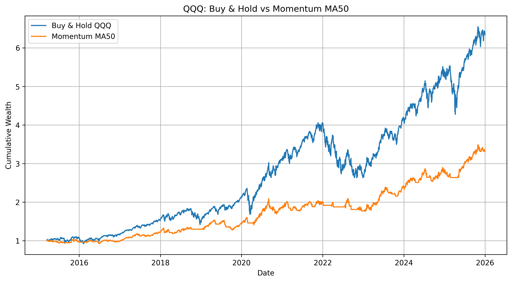

# Quantitative Trading Strategy: Nasdaq-100 Momentum

[Open in Google Colab](https://colab.research.google.com/drive/1kOjg5VVM1kofCBsdzQl8SCKNgkuaVqJ3?usp=sharing)

## Overview

This project implements a simple momentum trading strategy based on the
50-day moving average of QQQ, an ETF tracking the Nasdaq-100.

## Objectives

- Apply Python to financial market data.
- Calculate moving averages and trading signals.
- Backtest a simple systematic strategy.
- Compare the strategy with a Buy & Hold benchmark.
- Evaluate return and risk metrics.

## Methodology

The strategy uses the following rule:

- Hold QQQ when its closing price is above its 50-day moving average.
- Hold cash when its closing price is below its 50-day moving average.

The strategy is compared with a Buy & Hold investment in QQQ.

## Results

| Metric | Buy & Hold | Momentum MA50 |

| Total Return | 533.35% | 231.08% |

| Annualized Volatility | 22.09% | 13.92% |

| Sharpe Ratio | 0.89 | 0.87% |

| Maximum Drawdown | -35.12% | -18.87% |		

## Performance Comparison

## Technologies

- Python
- Google Colab
- pandas
- NumPy
- Matplotlib
- yfinance

## Limitations

The backtest compares the return and risk characteristics of a moving-average momentum strategy with a Buy & Hold benchmark. The results should be interpreted cautiously because transaction costs, slippage, taxes, and out-of-sample validation are not included.

- No transaction costs.
- No slippage.
- No taxes.
- The strategy is tested on historical data.
- Historical performance does not guarantee future results.
- The strategy uses a single technical indicator.
- No out-of-sample testing is included.

## Disclaimer

This project is for educational purposes only and does not constitute
investment advice.

## Author

Sacha Stojkovic

BSc in Economics and Finance + Magistère Economist Engineer

Aix-Marseille School of Economics — AMSE
